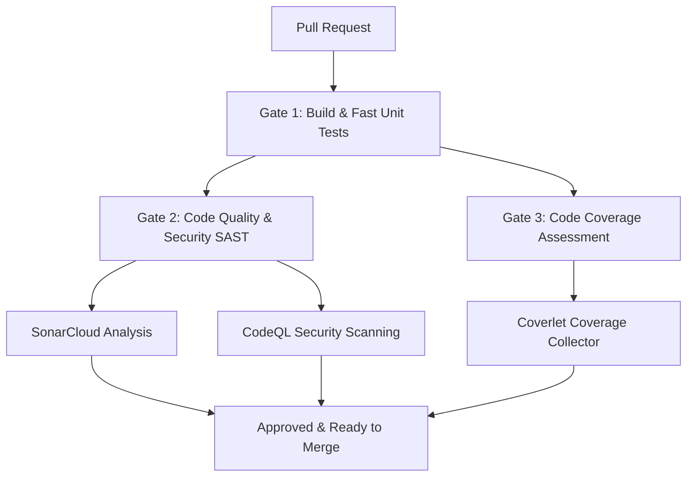

# CI/CD & Quality Gates Blueprint

This guide defines the CI/CD pipeline, pull request gates, test coverage strategy, and concurrency-testing approach for Flumewright. These quality gates establish visible, industry-standard signals for overall code health, security, and stability.

## 1. CI Pipeline Architecture & Gates

We employ a multi-layered quality-gate architecture integrated with GitHub Actions. Each pull request (PR) must pass three main validation gates:



### Gate 1: Build & Fast Unit Tests (Pre-Commit & CI)
* **Execution:** Triggered locally via git hooks and on every commit push to GitHub.
* **Scope:** Compile checks (with `WarningsAsErrors` enabled in `Directory.Build.props`) and rapid unit test suite execution.
* **Purpose:** Block obviously broken commits from entering remote branches.
* **Supply-chain:** all GitHub Actions in the workflows are pinned to commit SHAs (not moving tags) so only reviewed action code runs; Dependabot keeps the pins updated.

### Gate 2: Code Quality & Security (SAST)
* **SonarCloud (Primary Quality Gate):**
  * Analyzes code smells, duplication, vulnerabilities, maintainability, and code coverage.
  * Provides a public dashboard and a README status badge as a visual portfolio signal.
* **CodeQL (Security Analysis):**
  * Deep semantic analysis of security vulnerabilities.
  * Native GitHub Actions integration; alerts visible under the Security tab.
  * Complements SonarCloud by focusing on deep dataflow/control flow security bugs.
* **Dependabot:**
  * Enabled in the background for automated dependency vulnerability scanning and PR generation.
  * Serves as background hygiene; not featured as a primary pipeline step.

**Rollout & gating model:** the SonarCloud and CodeQL gates are introduced **soft first** — they run and
report on PRs but are not yet required checks in the branch-protection ruleset (a failure does not block
merge). After an observation period each is promoted to a **required check** (hard). The SonarCloud Quality
Gate evaluates **new code** (what a PR changed) rather than the whole tree, so it can be enforced without
legacy code blocking progress. (Concepts and lessons — OpenCover vs Cobertura, new-code gating, static
analysis vs human review, the Dependabot-secret pitfall — are written up in
[study-notes §11.8](../learning/study-notes.md).)

### Gate 3: Test Coverage (Coverlet)
* **Execution:** Coverlet collector runs as part of the test runner, emitting **OpenCover** format
  (SonarCloud's .NET scanner reads OpenCover; the default Cobertura format causes a silent "coverage 0%"):
  ```bash
  dotnet test --collect:"XPlat Code Coverage" -- DataCollectionRunSettings.DataCollectors.DataCollector.Configuration.Format=opencover
  ```
* **Output:** OpenCover XML, uploaded to SonarCloud by the SonarScanner step.
* **Coverage Strategy:**
  * Rather than chasing an arbitrary 100% score, the gate evaluates **new code** (a PR's changes) instead of the whole tree; this is the actual mechanism for "start low, raise gradually" — the gate can be on from the start without legacy code blocking it, and overall coverage rises as well-tested new code accumulates. (Overall coverage is ~91% as of M2.)
  * Coverage maps tested code paths, highlighting gaps rather than acting as a rigid metric.
* **Exclusions:** To ensure an accurate signal, the following paths are explicitly excluded from the coverage denominator:
  * Auto-generated Protobuf code (`Flumewright.Protocol`)
  * Application entry points / bootstrapping (`Program.cs`)
  * Security/Observability skeletons (`Flumewright.Security`, `Flumewright.Observability`)

---

## 2. Concurrency-Testing Strategy 🔒

Because Flumewright is a concurrent, asynchronous message broker, standard unit and integration tests are insufficient to guarantee correctness under load. We use a risk-tiered testing framework. (This is the CI-side view of the tiers below; the full five-layer concurrency strategy lives in [concurrency-strategy](../design/concurrency-strategy.md).)

### Tier 1: Concurrency Unit Tests
* Safe, concurrent test blocks built directly into the unit test suite (e.g. `Offsets_AreUniqueAndContiguousUnderConcurrentPublishes` executing 1,000 concurrent appends).
* Asserts lock integrity, atomic state progression, and thread safety of store/router logic.

### Tier 2: Load & Stress Testing (`load.yml`)
* Executed as background workflows to subject the broker to prolonged throughput and connection cycles.
* Exercises thread pools, Kestrel connection limits, and I/O channels under sustained pressure to expose race conditions or memory leaks indirectly.

### Tier 3: Systematic Concurrency Testing (Microsoft Coyote)
* **Tooling choice:** Microsoft Coyote is chosen for systematic concurrency exploration. It rewrites and monitors task execution to deterministically reproduce race conditions and deadlocks.
* **Adoption Plan:** **Deferred until after Milestone 3 (M3).** Since M3 introduces complex consumer-group partition assignment and offset commit concurrency, Coyote's systematic testing will be integrated then.

### Rejected Tools
* **Newman / Postman:** Rejected. Newman is an HTTP/REST-oriented functional test runner. Because Flumewright is a gRPC/Protobuf-based binary protocol and requires concurrency analysis rather than functional REST assertions, Postman/Newman does not fit the project's architecture.
